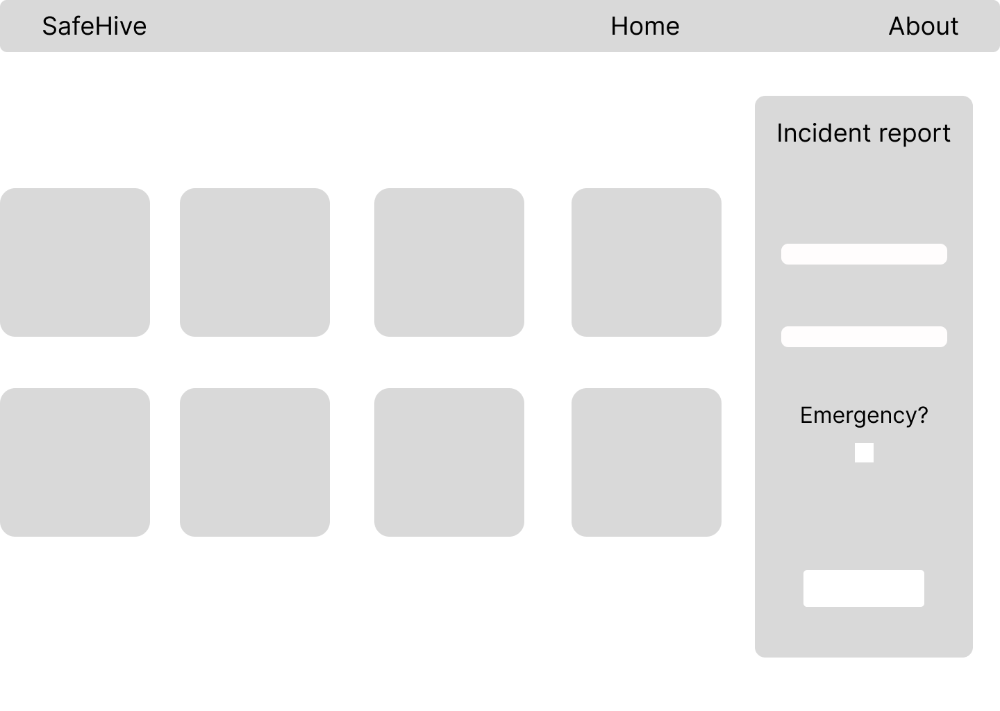

# SafeHive - Community Saftey and Crime Reporting
SafetyHive is a web-based platform designed to empower communities to enhance safety and to report incidents.

## Table of Contents
- [Features](#features)
- [Upcoming Features](#upcoming-features)
- [Mockups](#mockups)
- [Installation](#installation)

## Technologies used:
* Django
* HTML5
* React
* Node
* postgreSQL
* Python
* Render

## Mockups:

 


## Features:
- **Incident Reporting**: Easily report various types of incidents, including crimes, accidents, and suspicious activities.
- **Anonymous Reporting**: Protect privacy and safety with options for anonymous reporting, allowing users to submit reports without disclosing their identities.

## Upcoming Features
- **Geolocation Services**: Accurately pinpoint incident locations using GPS and mapping services. Visualize incident locations on a map.
- **Two-Way Communication**: Direct messaging between users and local law enforcement agencies for information exchange, assistance requests, and incident updates.
- **Incident Tracking**: View the status of reported incidents, track progress, and follow up as needed.
- **Reporting Analytics**: Tools for local law enforcement agencies to access data analytics and reporting features to identify crime patterns and allocate resources more effectively.

## Installation:
1. Clone this repository to your local machine:

   ```shell
   git clone https://github.com/abanobmorkos1/safehiveFE.git
   ```
2. Install Dependencies required for SafeHive:
   ```
   npm install
   ```
3. Start the devolopment server
   ```
   npm start
   ```

4. Acess the browser at 
   ```
   http://localhost:3000
   ```
